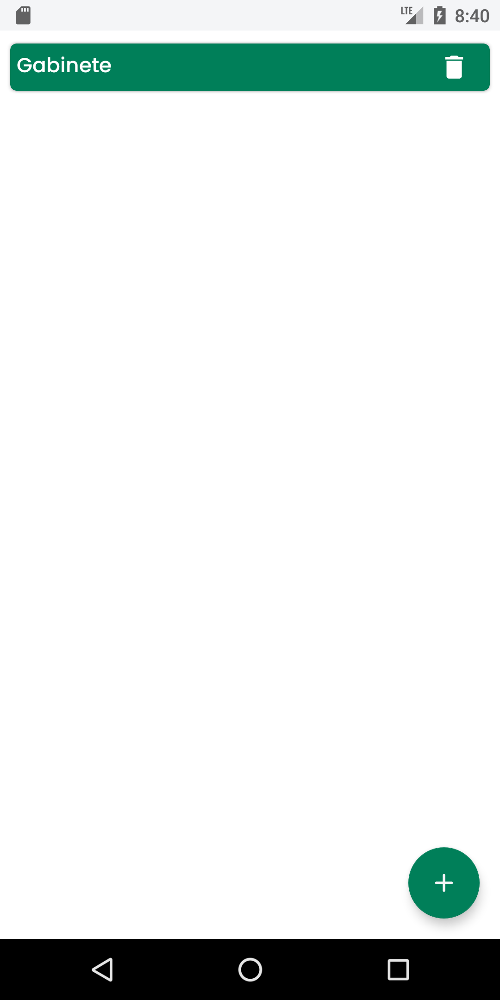
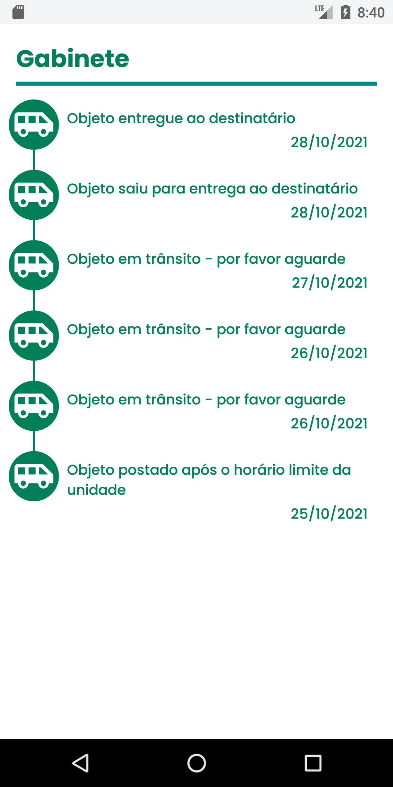

# RastreiAí

Um applicativo onde é possivel rastrear suas encomendas.

📱 **Capturas do projeto**.

🛠️ **Arquitetura usada:**

- MVVM(Model-View-ViewModel).
- Clean Architecture.

📦 **Banco de Dados:**

- Room.

🌐 **Rede:**

- Retrofit.
- Gson
- OkHttp
- Logging - Interceptor.

💉 **DI:**

- Dagger - Hilt.

📪 **Arguments**:

- SafeArgs.

🏃🏻‍♂️ **Coroutines:**

- Flow.
- ViewModelScope.